# 💫 Hi 👋, I'm Hammad Hanif
**A passionate Full Stack Developer(Next.js, React.js, Node.js, Javascript) || Wordpress Developer || AI & ML Engineer**

Email Me 👉 ✉️ **hamadhanif267@gmail.com.com** For Collaboration/Project or Anything Else. 😊😊

- 😄 **Pronouns:** Hammad Hanif
- ⚡ **Fun fact:** I Love Tech and Tech Love Me

## 🏆 GitHub Trophies

  

## 🌐 Socials:
  <!-- Snake Game Repo View -->

  

# 💻 Tech Stack:
                                        
# 📊 GitHub Stats:
 
 

### ✍️ Random Dev Quote

### 🔝 Top Contributed Repo

---

<!-- Proudly created with GPRM ( https://gprm.itsvg.in ) -->
